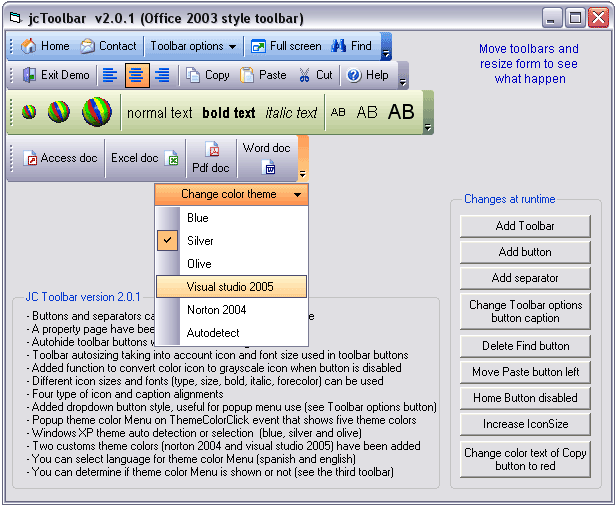



## jcToolbars 2\.0\.1 \(Office 2003 style\)

### Description

jcToolbars 2.0.1 is an Office 2003 style toolbar with 3 standard theme color (blue, silver and olive, includes also theme autodetection) and 2 custom colors (visual studio 2005 and norton 2004). It is a complete new version made from my first uploaded job last year. Four type of icon and caption alignments, different icon sizes and fonts, font color, etc.
 
### More Info
 

             |
---                |---
**Submitted On**   |2006-02-16 00:01:12
**By**             |[Juan Carlos San Román](https://github.com/Planet-Source-Code/PSCIndex/blob/master/ByAuthor/juan-carlos-san-rom-n.md)
**Level**          |Intermediate
**User Rating**    |4.9 (141 globes from 29 users)
**Compatibility**  |VB 6\.0
**Category**       |[Custom Controls/ Forms/  Menus](https://github.com/Planet-Source-Code/PSCIndex/blob/master/ByCategory/custom-controls-forms-menus__1-4.md)
**World**          |[Visual Basic](https://github.com/Planet-Source-Code/PSCIndex/blob/master/ByWorld/visual-basic.md)
**Archive File**   |[jcToolbars1974152172006\.zip](https://github.com/Planet-Source-Code/juan-carlos-san-rom-n-jctoolbars-2-0-1-office-2003-style__1-64367/archive/master.zip)

